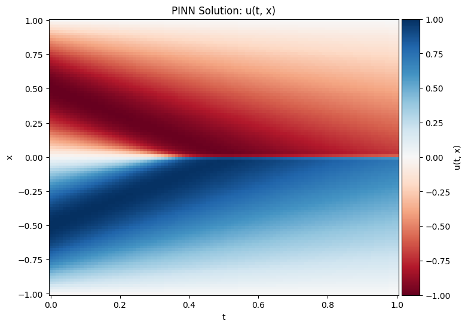
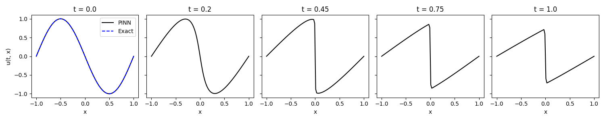
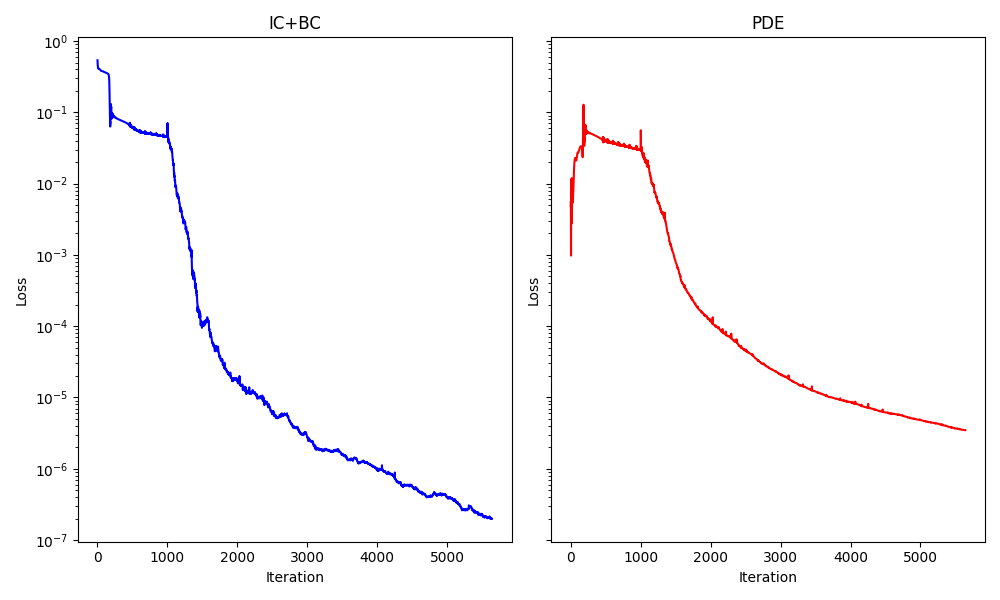

# Physics-Informed Neural Network for the Viscous Burgers Equation

This project implements a Physics-Informed Neural Network (PINN) in PyTorch to approximate the solution of the one-dimensional viscous Burgers equation.

The Burgers equation is a canonical nonlinear partial differential equation that combines nonlinear convection and viscous diffusion. It provides a useful benchmark for studying numerical methods and physics-informed machine learning techniques for time-dependent PDEs.

---

## 1. Problem Formulation

The one-dimensional viscous Burgers equation is

```math
\frac{\partial u}{\partial t}
+
u\frac{\partial u}{\partial x}
-
\nu\frac{\partial^2 u}{\partial x^2}
=
0,
```

where $u(t,x)$ is the unknown solution and $\nu$ is the kinematic viscosity.

For this implementation,

```math
\nu = \frac{0.01}{\pi}.
```

The computational domain is

```math
x \in [-1,1],
\qquad
t \in [0,1].
```

---

## 2. Initial and Boundary Conditions

The prescribed initial condition is

```math
u(0,x) = -\sin(\pi x).
```

Homogeneous Dirichlet boundary conditions are imposed at both ends of the spatial domain:

```math
u(t,-1)=0,
```

```math
u(t,1)=0.
```

Therefore, the PINN must simultaneously satisfy the governing PDE, the initial condition, and both boundary conditions.

---

## 3. Physics-Informed Neural Network

The neural network approximates the continuous mapping

```math
(t,x)
\longmapsto
u(t,x).
```

The implemented fully connected neural network contains:

- **Inputs:** $t$ and $x$
- **Hidden layers:** 5
- **Neurons per hidden layer:** 40
- **Activation function:** `Tanh`
- **Output:** $u(t,x)$
- **Weight initialization:** Xavier normal initialization
- **Input preprocessing:** normalization using the problem-domain bounds

PyTorch automatic differentiation is used to evaluate all derivatives required by the governing equation.

---

## 4. Physics-Informed PDE Residual

For a network prediction $u_\theta(t,x)$, the Burgers-equation residual is defined as

```math
f_\theta(t,x)
=
\frac{\partial u_\theta}{\partial t}
+
u_\theta
\frac{\partial u_\theta}{\partial x}
-
\nu
\frac{\partial^2 u_\theta}{\partial x^2}.
```

A physics-informed solution should satisfy

```math
f_\theta(t,x) \approx 0
```

throughout the computational domain.

The PDE loss is defined as the mean squared residual over the collocation points:

```math
\mathcal{L}_{\mathrm{PDE}}
=
\frac{1}{N_c}
\sum_{i=1}^{N_c}
\left[
f_\theta(t_i,x_i)
\right]^2.
```

---

## 5. Initial- and Boundary-Condition Loss

The initial-condition contribution is

```math
\mathcal{L}_{\mathrm{IC}}
=
\frac{1}{N_i}
\sum_{i=1}^{N_i}
\left[
u_\theta(0,x_i)
+
\sin(\pi x_i)
\right]^2.
```

The boundary-condition contribution is evaluated from the prescribed zero values at $x=-1$ and $x=1$.

The implementation combines the initial- and boundary-condition terms as

```math
\mathcal{L}_{\mathrm{IC+BC}}.
```

The complete training objective is therefore

```math
\boxed{
\mathcal{L}
=
\mathcal{L}_{\mathrm{IC+BC}}
+
\mathcal{L}_{\mathrm{PDE}}
}
```

which couples the available physical constraints directly to neural-network optimization.

---

## 6. Training-Point Sampling

Latin Hypercube Sampling (LHS) is used to distribute training points across the space-time domain.

| Point Set | Number of Points |
|---|---:|
| Initial-condition points | 1,000 |
| Boundary points at $x=-1$ | 1,000 |
| Boundary points at $x=1$ | 1,000 |
| Interior collocation points | 10,000 |

The collocation points are used exclusively to enforce the differential equation inside the domain.

---

## 7. Optimization Strategy

Training is performed sequentially using two optimizers.

### Stage 1 — Adam

The first stage uses Adam with

- Learning rate: `0.001`
- Iterations: `1000`

Adam provides the initial parameter optimization before switching to a quasi-Newton method.

### Stage 2 — L-BFGS

The second stage uses PyTorch's L-BFGS optimizer with

- Maximum iterations: `10000`
- Maximum function evaluations: `10000`
- History size: `100`
- Line search: `strong_wolfe`

This hybrid Adam–L-BFGS strategy is commonly useful in PINN optimization because the two methods provide complementary optimization behavior.

---

## 8. Predicted Solution

### Space-Time Solution Field

The trained network provides a continuous approximation of $u(t,x)$ across the computational domain.



The field shows the evolution of the initially sinusoidal profile under the combined effects of nonlinear convection and viscosity.

---

### Solution Cross-Sections

Predicted spatial profiles are shown at

```math
t =
0,\;
0.2,\;
0.45,\;
0.75,\;
1.0.
```



At $t=0$, the PINN prediction is compared with the prescribed analytical initial condition

```math
u(0,x)=-\sin(\pi x).
```

The current implementation does **not** include an analytical or independent numerical reference solution for $t>0$. Therefore, the later profiles are presented as PINN predictions rather than as validated exact-solution comparisons.

---

## 9. Training-Loss History

The optimization history separately tracks

- initial- and boundary-condition loss;
- PDE residual loss.



The reduction of both components indicates progressive enforcement of the prescribed conditions and the Burgers-equation residual during optimization.

---

## 10. Technologies

The implementation uses:

- Python
- PyTorch
- NumPy
- Matplotlib
- pyDOE
- Jupyter Notebook
- Automatic Differentiation
- Latin Hypercube Sampling
- Adam
- L-BFGS

CUDA acceleration is selected automatically when an available GPU is detected.

---

## 11. Repository Contents

```text
01-viscous-burgers-equation/
├── README.md
├── viscous-burgers-pinn.ipynb
└── figures/
    ├── solution-cross-sections.png
    ├── solution-field.png
    └── training-loss-history.png
```

The notebook contains the complete workflow, including sampling, network construction, physics-informed residual evaluation, optimization, prediction, and visualization.

---

## 12. Methodological Notes

This implementation is intended as a computational study of Physics-Informed Neural Networks for a nonlinear time-dependent PDE.

The model is constrained through:

1. the governing Burgers equation;
2. the prescribed initial condition;
3. the spatial boundary conditions.

However, the current implementation does not contain a high-resolution numerical benchmark or a full analytical reference solution for quantitative error evaluation throughout the space-time domain.

Accordingly, the results are reported as **physics-informed predictions** rather than as a fully benchmark-validated numerical solution.

---

## 13. Potential Extensions

Future extensions could include:

- comparison with a high-resolution finite-difference or spectral solution;
- relative $L_2$ error evaluation;
- adaptive residual-based collocation sampling;
- sensitivity analysis with respect to network depth and width;
- optimizer comparisons;
- loss-weighting strategies;
- studies at lower viscosity values;
- analysis of PINN behavior near steep solution gradients.

---

**Author:** Armin Amani
