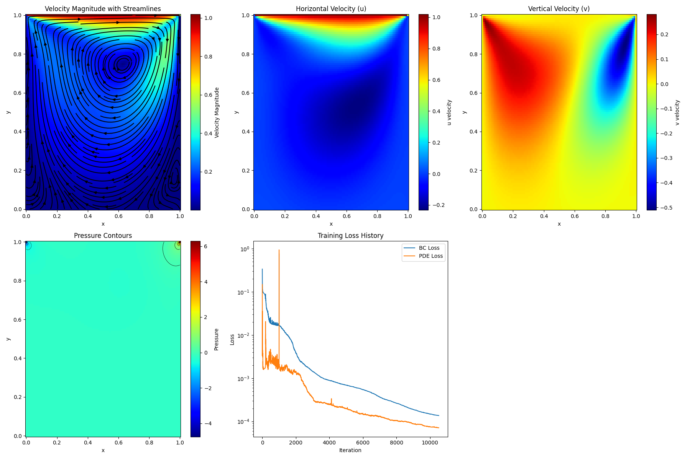

# PINN Solution of the Lid-Driven Cavity Flow

This project applies a Physics-Informed Neural Network (PINN) to the steady two-dimensional incompressible lid-driven cavity problem.

The lid-driven cavity is a classical computational fluid dynamics benchmark used to study recirculating viscous flows and numerical solutions of the incompressible Navier–Stokes equations.

## Physical Problem

The computational domain is a unit square:

\[
(x,y)\in[0,1]\times[0,1].
\]

The top wall moves horizontally with velocity

\[
U_{\text{lid}}=1,
\]

while the remaining walls are stationary.

The kinematic viscosity is

\[
\nu=0.01,
\]

giving a Reynolds number

\[
Re=\frac{U_{\text{lid}}L}{\nu}=100.
\]

## Governing Equations

The PINN enforces the steady incompressible Navier–Stokes equations.

### Continuity

\[
\frac{\partial u}{\partial x}
+
\frac{\partial v}{\partial y}
=0.
\]

### x-Momentum

\[
u\frac{\partial u}{\partial x}
+
v\frac{\partial u}{\partial y}
+
\frac{\partial p}{\partial x}
-
\frac{1}{Re}
\left(
\frac{\partial^2u}{\partial x^2}
+
\frac{\partial^2u}{\partial y^2}
\right)
=0.
\]

### y-Momentum

\[
u\frac{\partial v}{\partial x}
+
v\frac{\partial v}{\partial y}
+
\frac{\partial p}{\partial y}
-
\frac{1}{Re}
\left(
\frac{\partial^2v}{\partial x^2}
+
\frac{\partial^2v}{\partial y^2}
\right)
=0.
\]

The neural network predicts

\[
(x,y)\longrightarrow (u,v,p).
\]

## Boundary Conditions

No-slip conditions are imposed on the left, right, and bottom walls:

\[
u=0,\qquad v=0.
\]

On the moving top lid:

\[
u=1,\qquad v=0.
\]

## Neural Network Architecture

The implementation uses a fully connected feed-forward neural network with:

- 2 inputs: \(x\) and \(y\)
- 9 hidden layers
- 30 neurons per hidden layer
- `Tanh` activation functions
- 3 outputs: \(u\), \(v\), and \(p\)
- Xavier normal weight initialization
- normalized spatial inputs

Automatic differentiation in PyTorch is used to evaluate all first- and second-order spatial derivatives required by the governing equations.

## Physics-Informed Loss

The PDE loss consists of the residuals of:

- continuity
- x-momentum
- y-momentum

such that

\[
\mathcal{L}_{PDE}
=
\mathcal{L}_{continuity}
+
\mathcal{L}_{x-momentum}
+
\mathcal{L}_{y-momentum}.
\]

Boundary-condition loss is defined from the predicted and prescribed velocity components:

\[
\mathcal{L}_{BC}
=
\mathrm{MSE}(u-u_{BC})
+
\mathrm{MSE}(v-v_{BC}).
\]

The total optimization objective is

\[
\mathcal{L}
=
\mathcal{L}_{PDE}
+
\mathcal{L}_{BC}.
\]

## Training Points

Latin Hypercube Sampling is used to generate the training points.

| Point Type | Number |
|---|---:|
| Interior collocation points | 10,000 |
| Left-wall points | 500 |
| Right-wall points | 500 |
| Bottom-wall points | 500 |
| Top-lid points | 500 |
| Total boundary points | 2,000 |

## Optimization

Training is performed in two stages.

### Adam

- Learning rate: `0.001`
- Iterations: `1000`

### L-BFGS

The Adam stage is followed by L-BFGS optimization with:

- strong-Wolfe line search
- maximum iterations: `10000`
- history size: `100`

This hybrid optimization strategy is used to further reduce the physics-informed residuals after the initial Adam training stage.

## Results

The trained network predicts the velocity and pressure fields on a \(100\times100\) evaluation grid.



The visualization contains:

- velocity magnitude
- streamlines
- horizontal velocity \(u\)
- vertical velocity \(v\)
- pressure contours
- boundary-condition and PDE loss histories

The predicted velocity field exhibits the primary recirculating structure expected in lid-driven cavity flow.

## Pressure Interpretation

The current formulation does not impose a pressure reference such as

\[
p(x_0,y_0)=0.
\]

For incompressible flow, pressure is determined through its gradients and is therefore defined up to an arbitrary additive constant.

Consequently, the absolute pressure level should not be interpreted as a uniquely defined physical reference pressure.

## Implementation

The project uses:

- Python
- PyTorch
- NumPy
- Matplotlib
- pyDOE
- automatic differentiation
- Latin Hypercube Sampling
- Adam optimization
- L-BFGS optimization

CUDA acceleration is used automatically when available.

## Repository Contents

```text
02-lid-driven-cavity-navier-stokes/
├── README.md
├── lid-driven-cavity-pinn.ipynb
└── figures/
    └── lid-driven-cavity-results.png
```

## Methodological Notes

The current implementation demonstrates a physics-informed solution of the steady incompressible Navier–Stokes equations at \(Re=100\).

The notebook does not currently include an independent CFD reference solution, centerline benchmark comparison, or quantitative error metric against a validated numerical dataset.

Therefore, the presented fields should be interpreted as PINN predictions demonstrating qualitative physical behavior rather than a fully benchmark-validated CFD solution.

Sharp variations near the upper corners may also be influenced by the discontinuity between the moving lid and stationary side walls.

## Possible Extensions

Potential extensions include:

- comparison with benchmark CFD data
- centerline velocity validation
- quantitative relative-error analysis
- pressure-reference enforcement
- adaptive collocation-point sampling
- Reynolds-number studies
- alternative PINN architectures
- loss-weighting strategies
- higher-Reynolds-number cavity flows

---

**Author:** Armin Amani